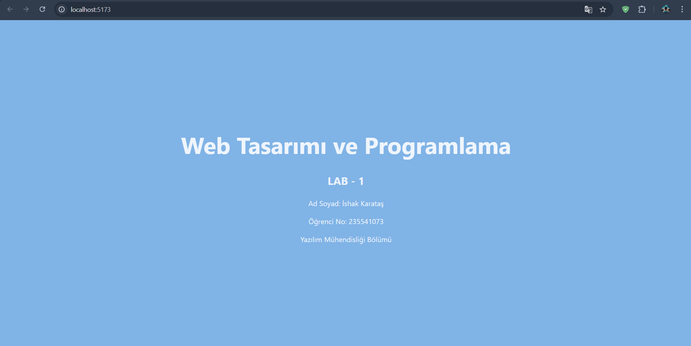

# Web LAB-1 - Hello Project

## Hakkında
Bu proje, Web Tasarımı ve Programlama dersi LAB-1 kapsamında Vite + React + TypeScript kullanılarak oluşturulmuştur.

## Geliştirici
- **Ad Soyad:** İshak Karataş
- **Öğrenci No:** 235541073

## Kullanılan Teknolojiler
- React 18
- TypeScript
- Vite

## Kurulum
```bash
npm install


## Ekran Görüntüsü
